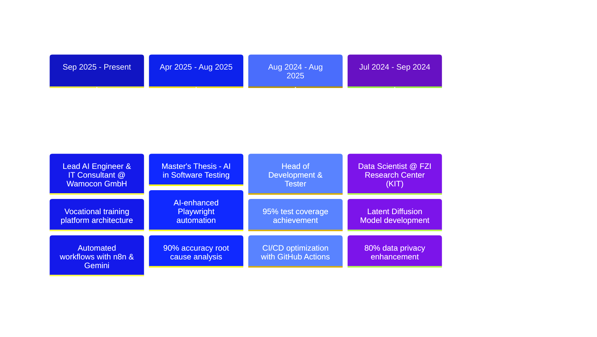

  

  
  
  

  
  

 
  
 

## 🚀 About Me

> **Lead AI Engineer & Data Scientist** with M.Sc. in Data Science and **3+ years** of experience in the AI lifecycle. Expert in building scalable generative AI solutions, RAG pipelines, and LLM integrations.

### 🎯 Impact Metrics

| Achievement | Impact |
|------------|--------|
| 🤖 **Administrative Automation** | **40%** reduction in workload |
| 🔍 **AI-Driven Root Cause Analysis** | **65%** improvement in bug resolution |
| ✅ **Test Coverage** | **95%** on mission-critical modules |
| 🔐 **Data Privacy Enhancement** | **80%** improvement via synthetic data |

### 💼 Current Role

**Lead AI Engineer & IT Consultant** at **Wamocon GmbH** *(Sep 2025 – Present)*
- 🏗️ Architecting vocational training platforms with role-based tracking
- ⚙️ Developing automated workflows using n8n and Google Gemini
- 🎯 Managing full project lifecycle from ideation to production

## 🛠️ Tech Stack

<b>🤖 GenAI & LLMs</b>

 

<b>🧠 ML & Data Science</b>

 

<b>💻 Languages & Databases</b>

 

<b>🎨 Frontend & Web</b>

 

<b>⚙️ DevOps & Automation</b>

 

## 💼 Experience Timeline

## 🚀 Featured Projects

| Project | Tech Stack & Impact |
|---------|-------------------|
| **🎓 CogniKids** AI-powered educational platform for children |     **95%** user satisfaction |
| **🧠 Knowledge Graph Extractor** LLM-powered structured data extraction for Hella/FORVIA |    Enterprise-grade solution |
| **🔍 Anomaly Detection System** LSTM-based real-time anomaly detection |    High accuracy on complex datasets |
| **🤖 AI Testing Framework** Automated E2E testing with AI-powered analysis |    **90%** accuracy in root cause analysis |

## 📊 GitHub Statistics

### 💻 Tech Stack Breakdown

<table>
<tr>
<td align="center" width="20%">

 <strong>TypeScript</strong>
</td>
<td align="center" width="20%">

 <strong>JavaScript</strong>
</td>
<td align="center" width="20%">

 <strong>Python</strong>
</td>
<td align="center" width="20%">

 <strong>CSS</strong>
</td>
<td align="center" width="20%">

 <strong>HTML</strong>
</td>
</tr>
</table>

### 📊 GitHub Activity

  
**🔥 Current Status:**  
📁 **8+ Public Repositories**  
💻 **195+ Total Commits**  
🎯 **Active in AI/ML & Full-Stack Development**  
🌱 **Building with TypeScript, React, Python & AI**  

### 📊 Detailed Activity

**Total Repositories:** 8+ | **Total Commits:** 195+ | **Total Stars:** Growing 🌟

**Key Projects:**
🏫 **Wamocon Academy** (React + TypeScript)  
🎓 **Master Thesis** (AI Testing Framework - TypeScript)  
💬 **LingoCall** (Communication Platform - JavaScript)  
🔍 **Anomaly Detection** (ML Project - Python)  
🚀 **Mumbi Pro** (Next.js + TypeScript)  

## 🎓 Education

**M.Sc. Data Science** | Friedrich-Alexander-Universität Erlangen-Nürnberg (FAU) | *Apr 2022 – Aug 2025*
- **GPA:** 2.7
- Focus: AI, Machine Learning, Deep Learning, Data Analytics

**B.E. Information Technology** | Gujarat Technological University | *May 2017 – Jul 2021*
- **GPA:** 2.0
- Foundation in Software Engineering and Computer Science

## 🌐 Languages

- **English:** C1 (Very Good)
- **German:** B1 (Good Knowledge)

  

---

  <i>⭐️ From <a href="https://github.com/yashbhesaniya">yashbhesaniya</a></i>

